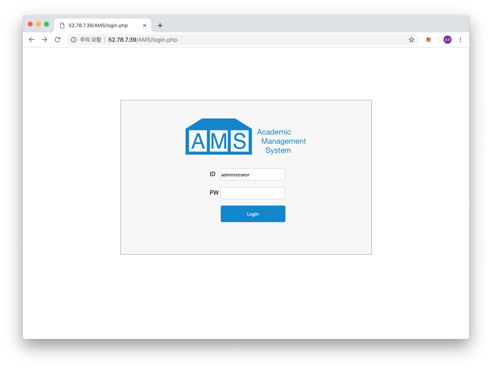
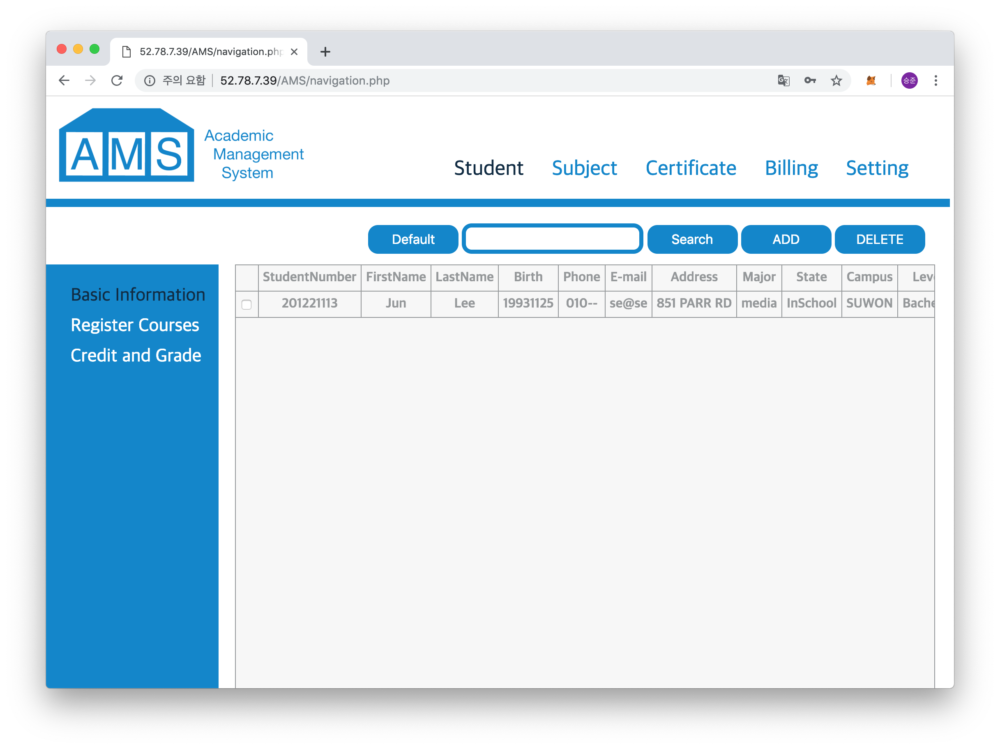

#AMS

Academic Management System


## 사전필요사항

* 웹서버
* mysql DB
* php

## Install AMS

* 사전필요사항이 모두 설치가 되었다면 웹서버에 AMS폴더를 복사한다

* mysql 접속후 database 생성과 table 생성

  ```sh
  $ mysql -u root -p
  password 입력(root)
  mysql > create database ams;
  mysql > use ams;
  mysql > create table semester  (idx int primary key auto_increment,SemesterName varchar(20) not null, DateOfStart varchar(20) not null, DateOfEnd varchar(20) not null);
  mysql > create table semester_student ( idx int primary key auto_increment, Semester varchar(20) not null, Student varchar(20) not null);
  mysql > create table semester_subject ( idx int primary key auto_increment, Semester varchar(20) not null, Subject varchar(20) not null);
  mysql > create table major (idx int primary key auto_increment,MajorName varchar(20) not null, MajorCode varchar(20) not null);
  mysql > create table professor (idx int primary key auto_increment, ProfessorNumber varchar(20) not null, Name varchar(20) not null, Phone  varchar(30) not null, Email varchar(30) not null, Major varchar(20) not null);
  mysql > create table campus (idx int primary key auto_increment,CampusName varchar(20) not null, CampusCode varchar(20) not null);
  mysql > create table student (idx int primary key auto_increment, StudentNumber varchar(20) not null, FirstName varchar(20) not null, LastName varchar(20) not null, Birth varchar(20) not null, Phone varchar(20) not null, Email varchar(30) not null, Address varchar(40) not null, Major varchar(20) not null, State varchar(20) not null, Campus varchar(20) not null, Level varchar(20) not null);
  mysql > create table students_lecture (idx int primary key auto_increment, Student varchar(20) not null, Semester varchar(20) not null, Subject varchar(20) not null, Grade varchar(20) default null);
  mysql > create table subject ( idx int primary key auto_increment, Code varchar(20) not null, LectureNum varchar(20) not null, Name varchar(40) not null, Professor varchar(20) not null, Credit varchar(20) not null, Classroom varchar(20) not null, Major varchar(20) not null, Level varchar(20) not null);
  ```


## AMS 접속

* "웹서버 주소"/AMS/login.php 접속

  

* ID, PW 모두 administrator 입력후 Login

  